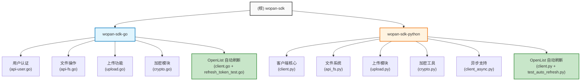

# wopan-sdk - AI 项目上下文

> 最后更新：2026-03-01 14:00:41
> 状态：已初始化多语言 SDK 项目，新增 OpenList 自动刷新功能

---

## 变更记录 (Changelog)

| 时间 | 变更内容 |
|------|----------|
| 2026-03-01 14:00:41 | 更新扫描结果，记录 OpenList 自动刷新 access_token 功能及完整测试覆盖 |
| 2026-02-26 14:11:25 | 增量更新：识别新增的调试脚本和测试文件，更新 index.json 路径 |
| 2026-02-25 21:31:54 | 更新扫描结果，新增 OpenList 管理后台认证支持，补充完整 API 文档 |
| 2026-02-21 16:30:19 | 完整扫描项目结构，识别 Go 和 Python 两个 SDK 模块，生成模块级文档 |
| 2026-02-21 16:26:32 | 初始化项目 AI 上下文 |

---

## 项目愿景

wopan-sdk 是一个多语言的联通沃盘（WoPan）SDK 项目，提供 Go 和 Python 两种语言的实现。该项目封装了联通沃盘的 API，使开发者能够轻松集成文件上传、下载、管理等功能到自己的应用中。

**核心价值：**
- 跨语言支持（Go、Python）
- 完整的文件管理功能
- 支持多种存储空间类型（个人空间、家庭空间、私有空间）
- 内置 AES 加密/解密
- 分片上传与断点续传支持
- 同步/异步 API 支持
- **OpenList 管理后台认证与自动刷新支持**（新增）

---

## 架构总览

### 技术栈

| 语言 | 依赖 |
|------|------|
| Go | `go-resty/resty/v2` (HTTP 客户端) |
| Python | `requests`, `pycryptodome`, `aiohttp` (异步) |

### 设计原则

- **模块化设计**：用户认证、文件操作、上传功能分离
- **加密优先**：所有 API 请求使用 AES-CBC 加密
- **多空间支持**：统一接口支持个人/家庭/私有空间
- **扩展性**：支持同步和异步两种调用模式
- **Mixin 模式**（Python）：通过注入扩展功能，保持核心简洁
- **令牌自动管理**：OpenList 模式下自动刷新过期的 access_token

---

## 模块结构图



---

## 模块索引

| 模块路径 | 职责描述 | 语言 | 入口文件 | 测试 | 状态 |
|----------|----------|------|----------|------|------|
| `wopan-sdk-go` | 联通沃盘 Go SDK - 提供完整的文件管理和上传功能 | Go | `client.go` | 5 个测试文件 | 已实现 |
| `wopan-sdk-python` | 联通沃盘 Python SDK - 支持同步/异步调用 | Python | `client.py` | 3 个测试文件 | 已实现 |

---

## 运行与开发

### Go SDK (wopan-sdk-go)

```bash
# 进入模块目录
cd wopan-sdk-go

# 安装依赖
go mod download

# 运行测试
go test -v ./...

# 示例使用
go run main.go
```

### Python SDK (wopan-sdk-python)

```bash
# 进入模块目录
cd wopan-sdk-python

# 安装依赖
pip install -r requirements.txt

# 开发模式安装
pip install -e .

# 运行测试
pytest tests/

# 代码格式化
black wopan_sdk/

# 代码检查
flake8 wopan_sdk/
```

---

## 测试策略

### Go SDK 测试

| 测试文件 | 覆盖内容 |
|----------|----------|
| `api-user_test.go` | 用户认证 API 测试 |
| `crypto_test.go` | 加密/解密功能测试 |
| `upload_test.go` | 文件上传功能测试 |
| `client_openlist_test.go` | OpenList 管理后台认证测试 |
| `refresh_token_test.go` | **OpenList 自动刷新功能完整测试**（新增） |

### Python SDK 测试

| 测试文件 | 覆盖内容 |
|----------|----------|
| `tests/test_basic.py` | 加密、客户端初始化、文件类型检测等基础功能 |
| `tests/test_openlist.py` | OpenList 管理后台认证测试 |
| `tests/test_auto_refresh.py` | **OpenList 自动刷新功能完整测试**（新增） |

### 测试运行命令

```bash
# Go
cd wopan-sdk-go && go test -v

# Python
cd wopan-sdk-python && pytest -v
```

---

## 编码规范

### Go 代码规范

- 遵循 Go 官方代码风格指南
- 使用 `gofmt` 格式化代码
- 导出函数使用大驼峰命名
- 私有函数使用小驼峰命名

### Python 代码规范

- 使用 `black` 进行代码格式化
- 使用 `flake8` 进行代码检查
- 遵循 PEP 8 规范
- 类型注解使用 `typing` 模块

---

## AI 使用指引

### 推荐工作流

1. **添加新 API 方法**
   - 在 `api-fs.go` 或 `api_fs.py` 中添加新方法
   - 定义请求/响应数据结构
   - 添加对应的常量到 `consts.go`/`consts.py`
   - 编写单元测试

2. **调试 API 调用**
   - 启用调试模式：`client.SetDebug(true)` (Go) 或 `client.set_debug(True)` (Python)
   - 查看请求/响应日志

3. **处理加密**
   - Go: 使用 `crypto` 包的 `Encrypt`/`Decrypt` 方法
   - Python: 使用 `Crypto` 类的 `encrypt`/`decrypt` 方法

### 常见任务指南

#### 添加新的文件操作 API

```go
// Go 示例
func (w *WoClient) NewFileOperation(param Json, opts ...RestyOption) (*ResponseData, error) {
    var resp ResponseData
    _, err := w.RequestWoHome(KeyNewMethod, param, JsonSecret, &resp, opts...)
    return &resp, err
}
```

```python
# Python 示例
def new_file_operation(self: WoClient, param: dict) -> ResponseData:
    result = self.request_wo_home(KEY_NEW_METHOD, param)
    return ResponseData(**result)
```

#### 处理不同空间类型

- **个人空间** (`SPACE_TYPE_PERSONAL` / `"0"`): 用户个人存储空间
- **家庭空间** (`SPACE_TYPE_FAMILY` / `"1"`): 需要提供 `familyId` 参数
- **私有空间** (`SPACE_TYPE_PRIVATE` / `"4"`): 需要先设置 `psToken`

#### 使用 OpenList 管理后台认证与自动刷新

```go
// Go 示例
client, err := wopan.DefaultWithOpenlist(wopan.OpenlistConfig{
    AdminToken: "your-admin-token",
    StorageID:  1,
})
if err != nil {
    log.Fatal(err)
}

// SDK 会自动在 token 过期时调用 RefreshToken() 从 OpenList 获取新 token
// 无需手动处理 token 刷新逻辑
```

```python
# Python 示例
from wopan_sdk import WoClient, OpenlistConfig

client = WoClient.default_with_openlist(OpenlistConfig(
    admin_token="your-admin-token",
    storage_id=1
))

# SDK 会自动在 API 返回 9999 错误时刷新 token 并重试请求
# 无需手动处理 token 刷新逻辑
```

---

## 核心常量配置

```go
// Go 常量
DefaultBaseURL      = "https://panservice.mail.wo.cn"
DefaultZoneURL      = "https://tjupload.pan.wo.cn"
DefaultClientID     = "1001000021"
DefaultClientSecret = "XFmi9GS2hzk98jGX"
DefaultPartSize     = 8 * 1024 * 1024  // 8MB
DefaultOpenlistBaseURL = "https://openlist.example.com"  // OpenList API 地址
OpenlistTimeout     = 30  // OpenList 请求超时时间（秒）
```

```python
# Python 常量
DEFAULT_BASE_URL = "https://panservice.mail.wo.cn"
DEFAULT_ZONE_URL = "https://tjupload.pan.wo.cn"
DEFAULT_CLIENT_ID = "1001000021"
DEFAULT_CLIENT_SECRET = "XFmi9GS2hzk98jGX"
DEFAULT_PART_SIZE = 8 * 1024 * 1024  # 8MB
DEFAULT_OPENLIST_BASE_URL = "https://openlist.example.com"  # OpenList API 地址
DEFAULT_OPENLIST_TIMEOUT = 30  # OpenList 请求超时时间（秒）
```

---

## 依赖说明

### Go 依赖
- `github.com/go-resty/resty/v2` - HTTP 客户端
- `golang.org/x/net` - 网络相关支持

### Python 依赖
- `requests>=2.31.0` - HTTP 客户端
- `pycryptodome>=3.19.0` - AES 加密支持
- `aiohttp>=3.9.0` - 异步 HTTP 支持（可选）

---

## OpenList 管理后台 API

项目新增对 OpenList 管理后台的认证支持，允许通过管理后台 API 获取访问令牌，并支持自动刷新机制。

### API 端点

```
GET /api/admin/storage/get_access_token?id={storage_id}
```

### 请求头

```
Authorization: {admin_token}
```

### 响应示例

```json
{
  "code": 200,
  "message": "success",
  "data": {
    "storage_id": 1,
    "token_info": {
      "access_token": "..."
    }
  }
}
```

### 自动刷新机制

- **触发条件**：当 API 返回错误码 `9999`（令牌过期）时
- **刷新策略**：
  1. 优先使用 OpenList 配置自动刷新
  2. 如果没有 OpenList 配置，则调用用户设置的回调函数
  3. 使用锁机制防止并发刷新
- **线程安全**：Go 使用 `sync.Mutex`，Python 使用 `threading.Lock`

详细文档请参考 [openlist-api.md](./openlist-api.md)。

---

*本文档由 AI 自动生成和维护。随着项目发展，请定期更新上述内容。*
